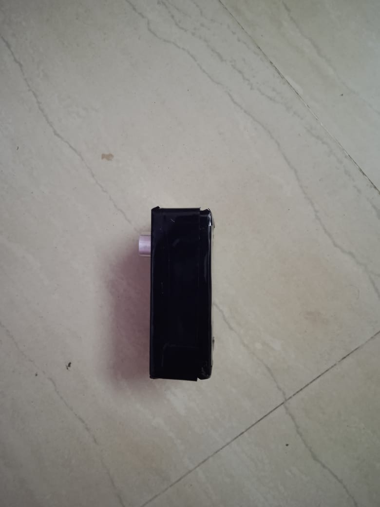

# 💧 Automatic Water Level Monitoring Tank Project (Ultrasonic + Relay + Motor)

## 📘 Overview
This project automates the control of a **water pump motor** using an **ultrasonic sensor** to measure the water level inside a tank.  
When the water level goes **below a certain range**, the relay turns **ON the motor** to fill the tank.  
Once the water level is **above the threshold**, the motor automatically **turns OFF** — ensuring no overflow or manual intervention.

---

## ⚙️ Components Used
- **Microcontroller:** ESP32 / Arduino UNO (any compatible board)  
- **Ultrasonic Sensor (HC-SR04)**  
- **Relay Module (5V or 3.3V logic compatible)**  
- **Water Pump / Motor**  
- **Jumper Wires**  
- **Power Supply**

---

## ⚡ Circuit Connections

| Component | Pin Connection (ESP32 Example) |
|------------|-------------------------------|
| Ultrasonic TRIG | GPIO 5 |
| Ultrasonic ECHO | GPIO 18 |
| Relay Signal | GPIO 16 |
| VCC & GND | 5V / 3.3V and GND respectively |

> ⚠️ **Note:** Relay modules are often **active LOW**, meaning:  
> - `digitalWrite(RELAY_PIN, LOW)` → Motor **ON**  
> - `digitalWrite(RELAY_PIN, HIGH)` → Motor **OFF**

---

## 🔌 Circuit Diagram


> Replace the image name with your actual file:  
> ``

---

## 💻 Arduino / ESP32 Code
```cpp
// Pin definitions
const int TRIG_PIN = 5;     // Ultrasonic TRIG
const int ECHO_PIN = 18;    // Ultrasonic ECHO
const int RELAY_PIN = 16;   // Relay control pin

// Distance threshold (in centimeters)
const int RANGE = 50; // Change as per your need

void setup() {
  Serial.begin(9600);
  
  pinMode(TRIG_PIN, OUTPUT);
  pinMode(ECHO_PIN, INPUT);
  pinMode(RELAY_PIN, OUTPUT);
  
  digitalWrite(RELAY_PIN, HIGH); // Relay OFF initially (active LOW)
}

void loop() {
  // --- Measure distance ---
  long duration;
  digitalWrite(TRIG_PIN, LOW);
  delayMicroseconds(2);
  digitalWrite(TRIG_PIN, HIGH);
  delayMicroseconds(10);
  digitalWrite(TRIG_PIN, LOW);
  
  duration = pulseIn(ECHO_PIN, HIGH);
  float distance = duration * 0.034 / 2; // convert to cm
  
  Serial.print("Distance: ");
  Serial.print(distance);
  Serial.println(" cm");
  
  // --- Relay control logic ---
  if (distance < RANGE) {
    Serial.println("Water below threshold → Motor ON");
    digitalWrite(RELAY_PIN, LOW); // ON (active LOW)
  } else {
    Serial.println("Water above threshold → Motor OFF");
    digitalWrite(RELAY_PIN, HIGH); // OFF
  }
  
  delay(500); // small delay to avoid rapid switching
}
```

---

## 🧠 Working Principle
1. The **ultrasonic sensor** measures the distance between the sensor and the water surface.  
2. If the distance is **greater than 50 cm (tank low)** → motor **turns ON** via relay.  
3. If the distance is **less than 50 cm (tank full)** → motor **turns OFF** automatically.  
4. The system continuously monitors and maintains the water level.

---

## 🧩 Customization
- Adjust the distance threshold in code:
  ```cpp
  const int RANGE = 50; // in cm
  ```
  Change it based on your tank size and sensor position.

- You can also:
  - Add **LCD / OLED display** for live water level.  
  - Add **Blynk / IoT** integration for remote monitoring.  
  - Use a **float sensor** as backup for safety.

---

## 📸 Top View


---

## 📸 Side View



---

## 🧑‍💻 Author
**Giriprasath TK**  
Project: *Automatic Water Level Monitoring Using Ultrasonic Sensor and Relay Control*
